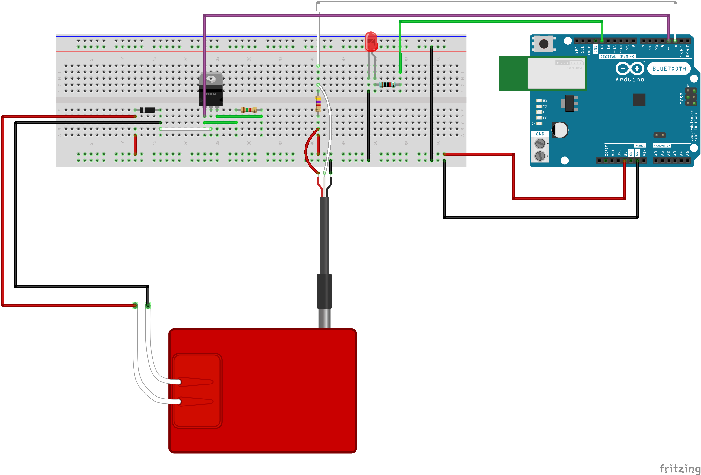

# Temperature controlled heating pad

Repo for a project with the goal of controlling the temperature of a heating pad using a temperature water sensor and an Arduino Uno board.

## Components

Arduino Uno.

[DS18B20 Temperature Water Sensor](https://www.electrokit.com/produkt/temperatursensor-vattentat-ds18b20/?gclid=Cj0KCQiAqvaNBhDLARIsAH1Pq51W8wtjMgXes7MsxoUsiI1zMgtzcqV4q0rrqWb3xKCoNye7ulqzY58aAo4wEALw_wcB).

[Heating Pad](https://www.electrokit.com/produkt/varmedyna-5x10cm/).

[Mosfet](https://www.electrokit.com/produkt/tip122-to-220-npn-100v-5a/).

[Diode](https://www.electrokit.com/en/product/1n4001-do-41-50v-1a-2/).

Resistors (10 kohm and 4.7 kohm), LED, Breadboard and Jumper Wires.

## Sketch

## Code

You will need the following libraries to use the DS18B20 sensor:

[1- Wire bus](http://www.pjrc.com/teensy/arduino_libraries/OneWire.zip)

[Dallas Temperature](https://github.com/milesburton/Arduino-Temperature-Control-Library)

Then, just upload the code from the HeatingTemperatureFeedback.ino to your Arduino.